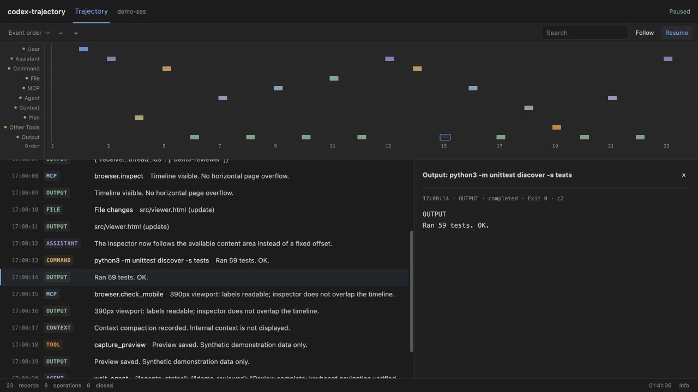

# codex-trajectory

**A quiet, live timeline for your Codex chats.**

[](https://github.com/Fly-Carrot/codex-trajectory/actions/workflows/tests.yml)


[](LICENSE)

See public messages, commands, file changes, MCP calls, agent operations and tool
outputs as they arrive. One shared local process. No additional model calls.
No API key. No KnowledgeOS dependency.



*Screenshot uses entirely fictional demonstration data, not a real conversation.*

## What you get

- One compact timeline row per present category. No empty tracks.
- Shared horizontal scrolling, event-order / clock-time views, zoom and live follow.
- A chronological ledger with searchable previews and click-to-inspect details.
- **Output** appears below Other Tools at the recorded return time. It is a linked
  view of a result, not a second tool call or proof that a side effect succeeded.
- One private URL per chat; exact transcript binding, never "the latest log".
- Optional global hook registers chats and supplies their link to Codex. A small
  English instruction asks Codex to append that link to its final reply.
- No automatic browser popups. No per-tool logging ritual or new task gate.

## Quick start

Requires **Python 3.10+**, macOS or Linux, and a local Codex client that writes
supported rollout logs. Windows is not supported in v0.1 (POSIX file locking).
Node is only used by JavaScript regression tests, not by the viewer.

```sh
git clone https://github.com/Fly-Carrot/codex-trajectory.git
cd codex-trajectory
python3 install.py --dry-run
python3 install.py
```

The installer copies the small runtime to `$CODEX_HOME/codex-trajectory` (default
`~/.codex/codex-trajectory`), appends one owned `UserPromptSubmit` hook to
`hooks.json`, and adds a delimited English block to `AGENTS.md`. Existing hooks,
custom instructions, `config.toml`, notify handlers and the app bundle are left
alone. Original hook/rule files are backed up privately before modification.
Re-running installation is idempotent.

**Review and trust the new hook in Codex `/hooks`.** Installation does not trust
it for you. Resume/start a conversation after reviewing it if the current client
has not reloaded hooks. Some clients expose hook review differently; see the
[official hooks documentation](https://developers.openai.com/codex/hooks).
Hosts without `UserPromptSubmit` support can use manual registration below.

After a new message, the hook registers the exact chat and supplies a link:

```text
[Trajectory](http://127.0.0.1:PORT/t/THREAD_ID#PRIVATE_TOKEN)
```

The rule asks the agent to include it at the end of the final reply. This is
**model-followed guidance, not a guaranteed UI injection**. The tool does not edit
old messages. Observer failures never block a task. If no link appears, inspect
hook trust and use the verified-link command below; do not guess a URL.

```sh
python3 ~/.codex/codex-trajectory/codex-trajectory --url --thread-id THREAD_ID
```

To use a non-default Codex home: `python3 install.py --codex-home /your/codex-home`.
The installer never enables feature flags, bypasses hook trust, or changes sandbox
permissions. Honor your host's own approval policy.

### Uninstall

```sh
python3 install.py --uninstall
```

This removes only the owned hook and rule block, preserving unrelated edits.
Runtime, private backups and state are retained for recovery. A running observer
exits after its normal idle timeout; closing the page stops active log polling.
The installed copy can also uninstall itself:
`python3 ~/.codex/codex-trajectory/app/install.py --uninstall`.

### Manual mode: no global edits

```sh
python3 trajectory.py --thread-id THREAD_ID --log /absolute/path/to/exact-rollout.jsonl
```

Open the returned private URL when needed. `--auto-open` is an explicit macOS
convenience, never the default. A resumed chat with a new physical log must be
registered again with that exact path. The viewer shows the selected rollout,
not reconstructed lifetime history across all old files.

## Event semantics

| Track | Meaning |
| --- | --- |
| User | Recorded user message |
| Assistant | Public progress/final message, not hidden reasoning |
| Command | Structured shell command and recorded execution status |
| File | Recorded file-change operation, not independent artifact verification |
| MCP | MCP server/tool, arguments, text result and recorded status |
| Agent | Dispatch/wait/collaboration operation, not a count of successful agents |
| Context | A compaction event; internal context is not shown |
| Plan / Search | Supported structured items, only when the source contains them |
| Other Tools | Other recorded function/custom-tool operations |
| Output | Linked result preview at a known return/completion timestamp |

Turn boundaries span tracks. Failures are red in their original track. Same-ID
starts/results/completions merge; distinct wrapper and nested calls stay distinct.
Output adds a visible marker/ledger row without inflating operation counts.
Timeline mark widths do not imply duration. Only recorded operation duration is
shown in details; no internal model latency is inferred. Reading a skill file
does not prove that the skill was executed. Unsupported schemas are omitted.

## How it works

```text
Codex UserPromptSubmit hook
  -> exact thread ID + transcript path
  -> one shared loopback broker
  -> private per-chat URL supplied to the agent
  -> browser requests recent public events only while visible
```

The observer reads local JSONL transcripts, not an App Server writer connection.
It polls at 1.5 seconds while visible. Hidden tabs use a lightweight 30-second
status check without reading logs. At most eight readers are cached; idle caches
expire after two minutes. An unused service exits after one hour. Each reader
starts in the last 2 MiB and keeps at most 160 canonical events plus linked output
views. Old history may be absent; this is not an archival or audit system.

## Privacy and security

- Loopback only; per-chat random bearer tokens, private state permissions.
- Strict Host/Origin checks, no CORS, no-store responses and restrictive CSP.
- Launcher verifies a nonce-based server identity proof before sending credentials.
- Chat tokens rotate on service restart. Fetch a fresh link after a restart;
  previously issued links may no longer work. The port/path stay stable if free.
- Source identity is checked on the same file descriptor on each read. Symlink
  replacement is rejected. The observer never modifies Codex transcripts.
- No reasoning, system/developer context or binary image payloads are rendered.
- Common credentials and home usernames are masked best-effort, **not a guarantee
  that arbitrary prose is safe to share**. Tool outputs can contain sensitive text.
- Never publish a real screenshot, token URL, transcript, runtime state or backup
  without reviewing it. This repo's screenshot is synthetic.

This is local HTTP, not an authenticated HTTPS origin or a sandbox against local
malware. A hostile process under the same user can read the underlying logs/state.
Another local process that takes over a stopped port can serve a fake page; token
rotation prevents old tokens from accessing a future legitimate service, but do
not enter private data into an unverified page. Stop using the observer if your
local host is untrusted.

## Development

```sh
python3 -B -m unittest discover -s tests -v
python3 demo.py
```

The demo creates fictional events in a temporary directory and serves the real
UI; it never reads your Codex logs. The runtime uses the Python standard library
and self-contained HTML/CSS/JS. No npm install, CDN, telemetry or remote font.

## Status and credits

**v0.1.0: experimental standalone observer.** Rollout schemas and hook support
vary by Codex version. Automated tests cover fixtures and installation boundaries,
not every host/version. Global auto-registration still needs a host-trusted hook.

Born from [KnowledgeOS](https://github.com/Fly-Carrot/KnowledgeOS), kept independent
of its kernel. Visual interaction inspired by the MIT-licensed
[DeepSeek Harness trajectory UI](https://github.com/deepseek-ai/deepseek-harness/tree/master/packages/client/ui-trajectory).
Independent implementation; no affiliation with OpenAI or DeepSeek. A Codex plugin
could later distribute this same observer, but it is not an agent Skill or MCP
server and does not require either to run.

See [CHANGELOG.md](CHANGELOG.md) and [SECURITY.md](SECURITY.md).
